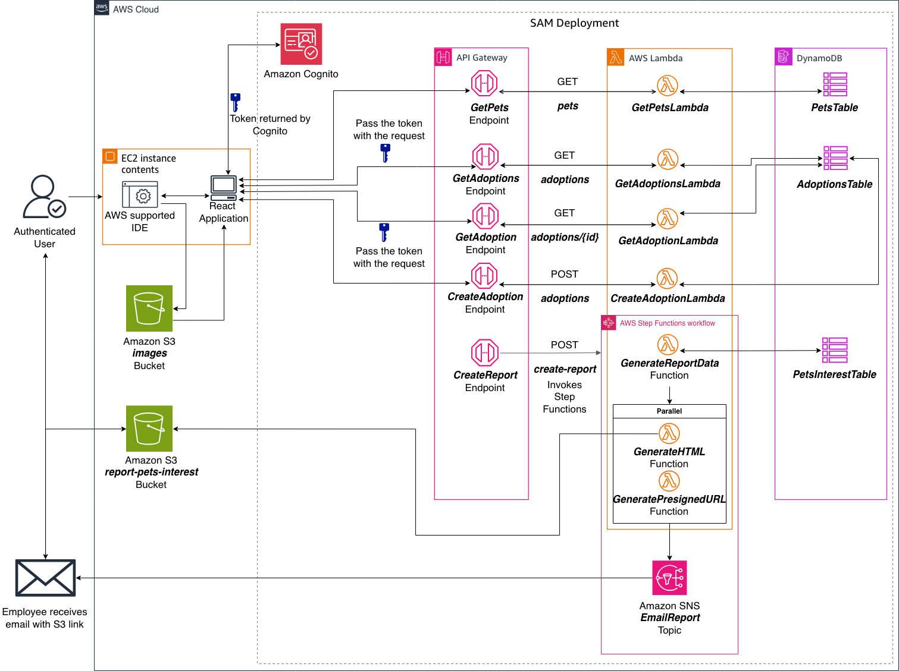

<div align="center">

# ACI-React-Pet-Shelter-Client

### Production-near-final serverless pet shelter archive for ACI Developer Intermediate 2

<p align="center">
  
  
  
  
</p>

<p align="center">
  
  
  
  
</p>

<p align="center">
  <b>Current Phase:</b> Week 6 complete - Step Functions reporting microservice
</p>

</div>

---

## Overview

This repository documents the **AnyCompany Pet Shelter** application for **ACI Developer Intermediate 2 Q2 2026**. It preserves the completed Week 1 through Week 6 course deliverables as archived zip packages, plus the architecture images and project-level notes needed to understand the application at each stage.

The application progresses from a standalone **React + Vite** client into a serverless AWS application using **Amazon API Gateway, AWS Lambda, Amazon DynamoDB, Amazon S3, Amazon Cognito, AWS Step Functions, and Amazon SNS**. Public visitors can browse pets and submit adoption applications. Signed-in employees can review adoption records and trigger an automated pet adoption interest report.

The root repository is intentionally documentation-first. Runnable source code is preserved inside the weekly archives under `docs/phase-zips/`, not expanded at the repository root.

## Current Status

| Category | Current State |
|----------|---------------|
| Project Status | Production near-final archive |
| Course Track | ACI Developer Intermediate 2 Q2 2026 |
| Current Lab Context | Building a Reporting Microservice with AWS Step Functions, `SPL-PW-300-DVF416-1` |
| Archive Coverage | Week 1 through Week 6 |
| Current Package | `docs/phase-zips/week-6-pet-shelter-client.zip` |
| Repository Type | Documentation and packaged phase artifacts |
| Live Source Location | Inside weekly zip archives, not expanded at the repository root |
| Architecture Image | Lab 6 after-state architecture diagram |

## Client Scenario

**AnyCompany Pet Shelter** needs an online adoption platform where visitors can browse pets, submit adoption applications, and where shelter employees can securely review application data. By Week 6, shelter staff also need management reporting that shows which pets are receiving more adoption interest so they can make better placement and outreach decisions.

The Week 6 archive represents the lab's near-final serverless shape: a React client, API Gateway routes, Lambda handlers, DynamoDB tables, S3-hosted images and reports, Cognito employee authentication, a Step Functions reporting workflow, and SNS email notification delivery.

## Architecture

The README now uses the Lab 6 after-state architecture image, which includes the reporting microservice added in the Step Functions lab.

<p align="center">
  
</p>

**Application flow**

`React pet shelter client -> Amazon API Gateway -> AWS Lambda -> Amazon DynamoDB`

`Employee sign-in -> Amazon Cognito hosted UI -> protected employee application review`

`Generate Report button -> POST /create-report -> CreateReportLambda -> AWS Step Functions`

`Step Functions -> GenerateReportData -> GenerateHTML -> GeneratePresignedUrl -> SNS email notification`

`Reports and pet images -> Amazon S3`

The after-state architecture has five API Gateway endpoints in scope: pets retrieval, adoption list retrieval, adoption detail retrieval, adoption submission, and report creation. The reporting endpoint starts a state machine that reads pet and interest data, creates an HTML report, stores it in S3, generates a presigned URL, and sends that URL through Amazon SNS.

## Phase 6 Archive Validation

Validated against the attached **Building a Reporting Microservice with AWS Step Functions** lab context on 2026-06-12.

| Lab expectation | Week 6 archive evidence |
|-----------------|-------------------------|
| Existing pet shelter backend with pets, adoptions, Cognito, and API Gateway | `backend/template.yaml` defines `PetsAPI`, `PetsTable`, `AdoptionsTable`, Cognito resources, and the pets/adoptions Lambda routes |
| Reporting data model for adoption interest | `PetsInterestTable`, `backend/scripts/pets_interest_data.json`, and `backend/scripts/populate_pets_interest_table.py` are present |
| State machine added with AWS SAM | `ReportGenerationStateMachine` is present in `backend/template.yaml` and points to `backend/statemachine/report_generation.asl.json` |
| Lambda sequence for report generation | `generate_report_data`, `generate_html`, and `generate_presigned_url` handlers are present under `backend/handlers/` |
| SNS delivery after report generation | `SNSReportTopic`, `SNSSubscription`, and the `SendSNSEmail` state are present |
| API Gateway endpoint to trigger reporting | `CreateReportLambda` exposes `POST /create-report` and outputs `CreateReportAPIEndpoint` |
| React employee workflow can trigger reporting | `pet-shelter-client/src/App.jsx` includes `handleGenerateReport` and a signed-in-only `Generate Report` button |

**Validation result:** the Week 6 archive matches the lab's required reporting microservice structure and after-state architecture at the source-tree and infrastructure-definition level.

**Packaging caveats:** the Week 6 zip is a lab workspace capture rather than a clean production distribution. It includes generated folders `pet-shelter-client/node_modules/` and `backend/.aws-sam/`, a session-specific `pet-shelter-client/.env`, and does not include a `phase-6-aws-migration-guide.md`, `setup.sh`, `requirements.txt`, or `requirements-dev.txt`. Before this archive is used as a final reusable package, remove generated artifacts, replace lab/session values, and add the Week 6 migration guide and setup files.

## Phase Progress

| Week | Package | Status | Focus |
|------|---------|--------|-------|
| Week 1 | `week-1-pet-shelter-client.zip` | Complete | React frontend baseline with local data and starter tests |
| Week 2 | `week-2-pet-shelter-client.zip` | Complete | Serverless pets API with API Gateway, Lambda, DynamoDB, and S3 image support |
| Week 3 | `week-3-pet-shelter-client.zip` | Complete | Adoptions read APIs and frontend application list/detail integration |
| Week 4 | `week-4-pet-shelter-client.zip` | Complete | Adoption application submission through `POST /adoptions` |
| Week 5 | `week-5-pet-shelter-client.zip` | Complete | Cognito employee authentication and protected adoption review routes |
| Week 6 | `week-6-pet-shelter-client.zip` | Complete | Step Functions reporting workflow, SNS email notification, and frontend report trigger |

## Platform and Tooling

| Layer | Tools and services |
|-------|--------------------|
| Frontend | React 18, Vite, React Router, Axios |
| Authentication | Amazon Cognito hosted UI and JWT-based API authorization |
| API | Amazon API Gateway REST endpoints |
| Compute | AWS Lambda with Python 3.12 handlers |
| Workflow | AWS Step Functions state machine using Amazon States Language |
| Data | Amazon DynamoDB tables for pets, adoption applications, and pet interest records |
| Storage | Amazon S3 for pet images and generated report HTML |
| Notifications | Amazon SNS email subscription for report delivery |
| Infrastructure | AWS SAM and CloudFormation |
| Operations | IAM roles, CloudWatch Logs, AWS CLI, SAM CLI, npm |

## What This Project Demonstrates

- A staged migration from local React data to AWS-backed serverless microservices.
- Public pet browsing and adoption submission flows backed by API Gateway, Lambda, DynamoDB, and S3.
- Employee-only application review using Cognito authentication and protected API routes.
- A reporting microservice orchestrated with AWS Step Functions.
- Asynchronous report delivery through SNS with S3 presigned URL access.
- Course-phase packaging that preserves each weekly milestone as a point-in-time artifact.

## Repository Structure

```bash
.
├── docs/
│   ├── images/
│   │   ├── DI2-PetShelter-Lab6-Architecture-After.png
│   │   ├── DI2-PetShelter-Lab6-Architecture-Before.png
│   │   └── pet-shelter-architecture.png
│   └── phase-zips/
│       ├── week-1-pet-shelter-client.zip
│       ├── week-2-pet-shelter-client.zip
│       ├── week-3-pet-shelter-client.zip
│       ├── week-4-pet-shelter-client.zip
│       ├── week-5-pet-shelter-client.zip
│       └── week-6-pet-shelter-client.zip
└── README.md
```

## Week 6 Package Tree

The Week 6 archive contains the lab-required reporting microservice tree plus generated lab workspace artifacts called out below.

```bash
week-6-pet-shelter-client.zip
├── backend/
│   ├── handlers/
│   │   ├── create_adoption/createAdoption.py
│   │   ├── create_report/createReport.py
│   │   ├── generate_html/generateHtml.py
│   │   ├── generate_presigned_url/generatePresignedUrl.py
│   │   ├── generate_report_data/generateReportData.py
│   │   ├── get_adoption/getAdoption.py
│   │   ├── get_adoptions/getAdoptions.py
│   │   └── get_pets/getPets.py
│   ├── scripts/
│   │   ├── adoptions.json
│   │   ├── create_images_bucket.py
│   │   ├── create_report_bucket.py
│   │   ├── pets_interest_data.json
│   │   ├── populate_adoptions_table.py
│   │   ├── populate_pets_interest_table.py
│   │   ├── populate_pets_table.py
│   │   └── postDataTestPayload.json
│   ├── statemachine/
│   │   └── report_generation.asl.json
│   ├── .aws-sam/                         # Generated SAM build output included in the lab capture
│   ├── samconfig.toml
│   └── template.yaml
└── pet-shelter-client/
    ├── .env                              # Lab/session-specific values
    ├── node_modules/                     # Generated npm dependencies included in the lab capture
    ├── public/
    ├── src/
    │   ├── components/
    │   │   ├── AboutUs.jsx
    │   │   ├── AdoptionForm.jsx
    │   │   ├── ApplicationDetail.jsx
    │   │   ├── Applications.jsx
    │   │   ├── Footer.jsx
    │   │   ├── Header.jsx
    │   │   ├── Home.jsx
    │   │   └── Pets.jsx
    │   ├── App.jsx                       # Cognito state, report trigger, and routes
    │   ├── index.css
    │   ├── main.jsx
    │   └── styles.css
    ├── index.html
    ├── package-lock.json
    ├── package.json
    └── vite.config.js
```

## Using the Packages

Each weekly archive is a point-in-time course milestone. To inspect a package, extract the zip into a temporary workspace, review the phase-specific guide when present, then configure AWS account values before deploying or running the application.

For Week 6, use the attached lab instructions as the authoritative setup guide until a reusable `phase-6-aws-migration-guide.md` is added to the archive. Replace any packaged `.env`, Cognito callback/logout URL, SNS subscription endpoint, SAM config, and account-specific values before reuse.

## Finalization Checklist

The Week 6 implementation is production-near-final for course demonstration purposes. These cleanup items remain before treating the archive as a polished reusable production package:

- Remove generated `node_modules/` and `.aws-sam/` directories from `week-6-pet-shelter-client.zip`.
- Replace session-specific `.env`, Cognito domain/callback/logout, SNS email, and SAM config values with templates or documented placeholders.
- Add `phase-6-aws-migration-guide.md`, `setup.sh`, `requirements.txt`, and `requirements-dev.txt` to match the earlier refreshed archive pattern.
- Rebuild the Week 6 zip after cleanup and re-run archive tree validation.
- Add a short validation transcript for SAM template validation, frontend build, and backend handler smoke checks when the clean package is ready.
