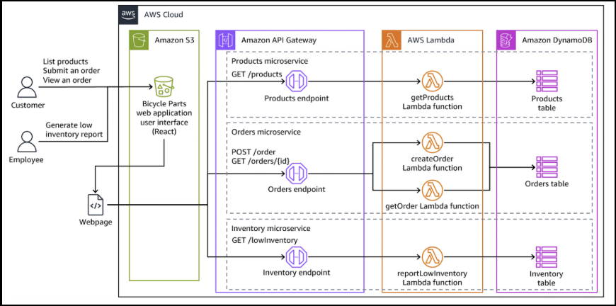

<div align="center">

# ACI-React-Pet-Shelter-Client

### Building a Serverless Pet Shelter Application with React and AWS

<p align="center">
  
  
  
  
</p>

<p align="center">
  
  
  
  
</p>

<p align="center">
  <b>Current Phase:</b> Week 3 complete, with Week 1 through Week 3 pet shelter deliverables refreshed, retested, and documented while later course weeks are still pending
</p>

</div>

---

## Overview

This repository documents the **AnyCompany Pet Shelter** project work for **ACI Developer Intermediate 2 Q2 2026** and captures the currently completed build scope through the published Week 1, Week 2, and Week 3 deliverables.

The progress preserved here starts with a standalone React + Vite frontend that uses local pet data, reusable UI components, client-side routing, and starter tests, then advances into serverless pets and adoptions read flows backed by **Amazon API Gateway, AWS Lambda, Amazon DynamoDB, and Amazon S3**.

By the end of the current Week 3 package, the project matches the lab's core resource topology closely: a React client, API Gateway endpoints for pets and adoptions, dedicated Lambda handlers, separate `PetsTable` and `AdoptionsTable` resources, and AWS SAM-managed deployment. Where the package differs, it generally favors personal-account-friendly improvements such as SAM-managed least-privilege policies and on-demand DynamoDB billing.

The project is ultimately aiming to become a cloud-native pet shelter web application where users can browse adoptable pets through a static React frontend, retrieve live shelter inventory and adoption data from AWS-backed microservices, and continue expanding into broader adoption-related workflows as later project work is completed. At the current stage, this repository functions as the **documentation and packaged-deliverable record** for that build progress. The Week 1, Week 2, and Week 3 application snapshots are preserved as archived zip packages and have not yet been expanded into the repository as live source code.

---

## Repository Description

ACI Developer Intermediate 2 Q2 2026 repository for documenting the AnyCompany Pet Shelter build, storing architecture assets, and preserving the packaged Week 1 frontend, Week 2 pets microservice, and Week 3 adoptions read-flow snapshots that move the project toward a full AWS serverless application.

---

## Client Scenario

**AnyCompany Pet Shelter** is a newly formed non-profit that needs a web application where customers can browse pets available for adoption and begin the adoption process, while the development team follows AWS serverless and microservices best practices introduced in the course.

The initial archived version of the project uses a React frontend with hardcoded pet and application data. The Week 2 archived deliverable moves the project toward a live AWS-backed workflow by retrieving pet data through API Gateway and Lambda, storing pet records in DynamoDB, and preparing pet images and static site hosting for Amazon S3. The Week 3 archived deliverable expands that flow with adoptions read APIs, an adoptions DynamoDB table, and frontend integration for applications and application details.

---

## Current Status

| Category | Current State |
|----------|---------------|
| Project Status | In Progress |
| Course Track | ACI Developer Intermediate 2 Q2 2026 |
| Archive Coverage | Week 1 through Week 3 preserved |
| Repository Type | Documentation and packaged phase artifacts |
| Deployment Target | AWS serverless environment |
| Application Type | React web application with serverless pets and adoptions read APIs |
| Current Focus | Week 3 archive validated, AWS deployment guidance aligned, and repo documentation rolled forward |

---

## Architecture Diagram

This project follows the broader pet shelter target architecture introduced in the course: a React single-page application hosted as a static site and multiple AWS-backed microservices that support pet browsing and adoption-related workflows.

<p align="center">
  
</p>

**Architecture flow**  
`User → Amazon S3-hosted React web application → Amazon API Gateway`  
`Amazon API Gateway → Pets and Adoptions microservices → AWS Lambda functions → Amazon DynamoDB tables`  
`Core flows → list pets, list adoptions, and view adoption details`

> This diagram represents the higher-level target architecture for the pet shelter project. The archived Week 1 through Week 3 packages preserved in this repository capture earlier implementation milestones within that broader direction, with the Week 3 archive now matching the lab's core API Gateway, Lambda, DynamoDB, and React application shape while also using personal-account-friendly deployment defaults.

---

## Platform and Tooling

<table>
  <tr>
    <td valign="top" width="50%">

### AWS Services in Scope

| Service | Purpose |
|---------|---------|
| Amazon S3 | Hosts the static frontend and the pet image objects used by the Pets and Applications pages |
| Amazon API Gateway | Exposes the `GET /pets`, `GET /adoptions`, and `GET /adoptions/{id}` routes |
| AWS Lambda | Runs the three read handlers for pets and adoptions data |
| Amazon DynamoDB | Stores pet records and adoption application records in separate tables |
| AWS SAM / CloudFormation | Defines and deploys the backend infrastructure |
| IAM | Supports Lambda execution permissions |

  </td>
  <td valign="top" width="50%">

### Tech Stack

| Layer | Tools / Services |
|-------|------------------|
| Languages | JavaScript / JSX, Python 3.12 |
| Frontend | React 18, Vite |
| Routing | React Router |
| Data Fetching | Axios |
| Testing | Vitest, Testing Library, Python `unittest` |
| Infrastructure as Code | AWS SAM, CloudFormation |
| Storage / Data | Amazon S3, Amazon DynamoDB |
| Tooling | ESLint, npm, pip, AWS CLI, AWS SAM CLI |

  </td>
  </tr>
</table>

---

## Project Scope and What This Project Demonstrates

This project is designed to move a pet shelter application from a local mock-data frontend toward an AWS-integrated microservices architecture while building practical experience across React foundations, API integration, serverless infrastructure, testing, and packaged project documentation.

Through the work currently preserved in this repository, the project demonstrates:

- building a multi-page React client for a pet shelter use case
- analyzing a React application structure in the context of a microservices design course
- displaying and filtering adoptable pets by species
- calculating time in shelter from intake dates
- creating adoption-related UI flows and supporting pages
- writing starter frontend tests for rendering and utility logic
- preparing a static frontend for Amazon S3 website hosting
- replacing hardcoded pet data with live API retrieval
- adding read-only adoptions API flows for applications and application detail views
- defining serverless backend resources with AWS SAM
- seeding DynamoDB data for both pets and adoptions records and preparing S3-hosted image delivery
- packaging tested migration guides and local setup workflows for handoff use
- preserving milestone snapshots as packaged deliverables

---

## Phase Guide and Package Notes

This repository currently serves as the documentation and packaging layer for the project rather than the live application source itself.

At this stage, the repository contains:

- project documentation
- architecture image assets used in the README
- packaged **Week 1**, **Week 2**, and **Week 3** application snapshots stored as zip archives under `docs/phase-zips/`
- refreshed migration guides, setup files, and validation support inside the archived packages
- package-level AWS deployment instructions and local setup support files for the archived milestones
- documentation aligned to the current pet shelter project scope rather than the unrelated appointments example

The live project files for all archived weeks are preserved inside the zip packages and are not yet extracted into the root repository as active source code.

This approach keeps the repository clean while still preserving the project deliverables, architecture assets, and the current state of work completed so far.

Each zip package acts as a point-in-time snapshot of the application and can be used for reference, backup, migration, or later extraction into a live working codebase.

---

## Repository Structure

```bash
.
├── docs/                                      # Project documentation and supporting assets
│   ├── images/                                # Images used in documentation and README
│   │   └── pet-shelter-architecture.png       # Architecture diagram for the project
│   └── phase-zips/                            # Archived project deliverables
│       ├── week-1-pet-shelter-client.zip      # Week 1 packaged React frontend snapshot
│       ├── week-2-pet-shelter-client.zip      # Week 2 packaged frontend + pets backend snapshot
│       └── week-3-pet-shelter-client.zip      # Week 3 packaged frontend + pets/adoptions backend snapshot
└── README.md                                  # Project overview, architecture, and status tracking
```

---

## Phase Package Contents

<details>
<summary><b>Week 1 Package Contents</b></summary>

The archived Week 1 application package contains the standalone React client source, the initial frontend test files, and a refreshed migration guide for local setup and course-aligned Amazon S3 website hosting.

```bash
week-1-pet-shelter-client.zip
└── pet-shelter-client/
    ├── .eslintrc.cjs                    # ESLint configuration for local validation
    ├── .gitignore                       # Excludes dependencies and build output
    ├── src/                              # Frontend source
    │   ├── components/                   # Routed page components and layout pieces
    │   │   ├── Header.jsx                # Navigation and branding
    │   │   ├── Home.jsx                  # Shelter landing page
    │   │   ├── AboutUs.jsx               # Shelter information page
    │   │   ├── Pets.jsx                  # Pet cards, species filter, days-in-shelter display
    │   │   ├── AdoptionForm.jsx          # Adoption form shell
    │   │   ├── ApplicationInfo.jsx       # Application details page
    │   │   ├── Applications.jsx          # Mock application list page
    │   │   └── Footer.jsx                # Footer and copyright
    │   ├── __test__/                     # Vitest test files
    │   │   ├── App.test.jsx              # Main page rendering checks
    │   │   └── utils.test.js             # Utility tests for shelter-day calculations
    │   ├── assets/                       # Local pet, shelter, and branding images
    │   ├── App.jsx                       # Route setup and local pets data
    │   ├── main.jsx                      # App bootstrap
    │   ├── utils.js                      # daysInShelter helper
    │   ├── styles.css                    # Main UI styling
    │   └── index.css                     # Global styles
    ├── public/
    │   └── logo.png                      # Public logo asset
    ├── index.html
    ├── package-lock.json                 # Locked npm dependency tree for repeatable installs
    ├── package.json                      # React, Vite, Vitest, Testing Library scripts and deps
    ├── phase-1-aws-migration-guide.md    # Step-by-step guide for local setup and S3 website hosting
    ├── setup.sh                          # One-command setup for local development
    ├── vite.config.js                    # Vite config
```

### Structure Notes

- **`week-1-pet-shelter-client.zip`** contains the standalone Week 1 React frontend snapshot.
- Pet data in this archive is stored directly in `src/App.jsx` as local mock data.
- The package includes `App.test.jsx` and `utils.test.js` for the frontend validation workflow.
- `phase-1-aws-migration-guide.md` and `setup.sh` were added so the archive can be used directly outside the lab environment.
- The Week 1 guide now follows the course-aligned Amazon S3 website hosting path for the static frontend.
- All pet and shelter imagery is served from bundled local assets in this archived version.

</details>

<details>
<summary><b>Week 2 Package Contents</b></summary>

The archived Week 2 application package contains the updated React client, the serverless AWS backend files used to retrieve live pet data, and refreshed setup files for local validation, SAM deployment, S3 image hosting, and S3 static website hosting in a personal AWS account.

```bash
week-2-pet-shelter-client.zip
├── backend/
│   ├── handlers/
│   │   └── get_pets/
│   │       └── getPets.py               # Lambda handler for GET /pets
│   ├── scripts/
│   │   ├── create_images_bucket.py      # Creates and configures the S3 images bucket
│   │   └── populate_pets_table.py       # Seeds DynamoDB with sample pets
│   ├── tests/
│   │   └── test_get_pets.py             # Backend unit tests for successful and failed handler responses
│   ├── template.yaml                    # AWS SAM template for API Gateway, Lambda, and DynamoDB
│   └── .gitignore                       # Excludes SAM build artifacts and Python cache files
├── pet-shelter-client/
│   ├── .env.example                     # Frontend environment template for API and S3 settings
│   ├── src/
│   │   ├── components/                  # Updated frontend views
│   │   ├── __test__/                    # Frontend test files
│   │   ├── data/fallbackPets.js         # Packaged sample data used when no API URL is configured
│   │   ├── test/setup.js                # Vitest Testing Library setup
│   │   ├── assets/                      # Local assets still used by some static pages
│   │   ├── App.jsx                      # API-driven pet retrieval with packaged fallback data
│   │   ├── styles.css                   # Main styling
│   │   ├── main.jsx                     # App bootstrap
│   │   └── index.css                    # Global styles
│   ├── public/
│   ├── .eslintrc.cjs                    # ESLint configuration
│   ├── .gitignore                       # Excludes node_modules, build artifacts, and .env
│   ├── index.html
│   ├── package.json                     # Frontend dependencies including Axios, Vitest, and PropTypes
│   ├── package-lock.json
│   ├── vite.config.js
├── phase-2-aws-migration-guide.md       # Step-by-step guide for local setup, SAM deployment, and S3 website hosting
├── requirements-dev.txt                 # Python dev dependencies for backend validation
├── requirements.txt                     # Python runtime dependencies for local backend scripts
└── setup.sh                             # One-command setup for frontend and backend validation
```

### Structure Notes

- **`week-2-pet-shelter-client.zip`** contains the Week 2 archived snapshot with both frontend and backend files.
- `backend/template.yaml` now defaults to a personal-account-friendly SAM deployment with SAM-managed IAM permissions and on-demand DynamoDB billing.
- The frontend can run with packaged sample data when `VITE_API_GATEWAY_URL` is not configured, making local verification easier before AWS resources are deployed.
- `phase-2-aws-migration-guide.md`, `setup.sh`, `requirements.txt`, and `requirements-dev.txt` were added so the archive can be used directly outside the lab environment.
- The Week 2 guide now documents the packaged backend deployment flow, stack-output lookup, DynamoDB seeding, S3 image hosting, and S3 static website deployment path used by the pet shelter project.
- Adoption submission and applications retrieval remain scaffolded in the frontend, but the archived package does not yet include fully deployed backend flows for those features.

</details>

<details>
<summary><b>Week 3 Package Contents</b></summary>

The archived Week 3 application package contains the React client, the expanded serverless backend for pets and adoptions read flows, and a full set of setup and AWS deployment support files for validating and deploying the package in a personal AWS account.

```bash
week-3-pet-shelter-client.zip
├── backend/
│   ├── handlers/
│   │   ├── get_pets/
│   │   │   └── getPets.py               # Lambda handler for GET /pets
│   │   ├── get_adoptions/
│   │   │   └── getAdoptions.py          # Lambda handler for GET /adoptions
│   │   └── get_adoption/
│   │       └── getAdoption.py           # Lambda handler for GET /adoptions/{id}
│   ├── scripts/
│   │   ├── populate_pets_table.py       # Seeds the deployed pets table
│   │   ├── populate_adoptions_table.py  # Seeds the deployed adoptions table
│   │   ├── adoptions.json               # Sample adoptions data used by the seed script
│   │   └── create_images_bucket.py      # Creates and configures the public-read images bucket
│   ├── tests/
│   │   ├── test_get_pets.py             # Backend tests for the pets Lambda handler
│   │   ├── test_get_adoptions.py        # Backend tests for the adoptions list handler
│   │   └── test_get_adoption.py         # Backend tests for the adoption detail handler
│   ├── template.yaml                    # AWS SAM template for the Week 3 backend resources
│   ├── samconfig.toml                   # Saved SAM deploy defaults for the Week 3 stack
│   └── .gitignore                       # Excludes SAM build artifacts and Python cache files
├── pet-shelter-client/
│   ├── .env.example                     # Frontend environment template for API and image settings
│   ├── src/
│   │   ├── components/                  # Updated frontend views and routed pages
│   │   ├── data/fallbackPets.js         # Packaged sample pets data for local fallback mode
│   │   ├── data/fallbackAdoptions.js    # Packaged sample adoptions data for local fallback mode
│   │   ├── assets/                      # Local imagery bundled with the archive
│   │   ├── App.jsx                      # Pets API integration and route setup
│   │   ├── styles.css                   # Main styling
│   │   ├── main.jsx                     # App bootstrap
│   │   └── index.css                    # Global styles
│   ├── public/
│   ├── .eslintrc.cjs                    # ESLint configuration
│   ├── .gitignore                       # Excludes node_modules, build artifacts, and .env
│   ├── README.md                        # Frontend-specific package notes and environment guidance
│   ├── index.html
│   ├── package.json                     # Frontend dependencies including Axios and React Router
│   ├── package-lock.json
│   └── vite.config.js
├── phase-3-aws-migration-guide.md       # Step-by-step guide for local setup, SAM deployment, and S3 website hosting
├── requirements-dev.txt                 # Python dev dependencies for backend validation
├── requirements.txt                     # Python runtime dependencies for local backend scripts
└── setup.sh                             # One-command setup for frontend and backend validation
```

### Structure Notes

- **`week-3-pet-shelter-client.zip`** contains the latest archived full-stack snapshot currently preserved in the repository.
- `backend/template.yaml` defines two DynamoDB tables, three Lambda handlers, and API Gateway routes for `GET /pets`, `GET /adoptions`, and `GET /adoptions/{id}`.
- The Week 3 backend mirrors the lab's core architecture pattern with separate read-focused Lambda functions, distinct pets and adoptions DynamoDB tables, and AWS SAM as the deployment entry point.
- `backend/samconfig.toml` now defaults to a Week 3 stack name and saved SAM deployment settings that match the packaged migration guide.
- The packaged infrastructure intentionally improves a few lab defaults for reuse in personal AWS accounts, including SAM-managed `DynamoDBReadPolicy` permissions and DynamoDB `PAY_PER_REQUEST` billing.
- `phase-3-aws-migration-guide.md`, `requirements.txt`, `requirements-dev.txt`, and `setup.sh` were added so the archive can be used directly outside the lab environment.
- The frontend can run with packaged sample pets and adoptions data when `VITE_API_GATEWAY_URL` is not configured, which makes local verification possible before AWS resources exist.
- The archived UI still includes the adoption submission form shell, but the packaged backend remains read-only for adoptions at this stage.

</details>

---

## Weekly Status Log

<details>
<summary><b>Week 1</b> - Developing on AWS</summary>

### Lab Focus
- Review the pet shelter MVP use case and React project structure
- Create, validate, and test a basic React application
- Build routed pages and reusable components
- Display local pet data and add species filtering

### Status
**Completed**

### Outcome
The Week 1 snapshot contains a working React client with Home, About Us, Pets, Adopt, Application Info, and Applications views. The Pets page renders nine sample pets, supports dog and cat filtering, and calculates how long each pet has been in the shelter using a shared utility function.

### What Was Added
- `src/App.jsx` — route-based application shell with local pet data
- `src/components/Pets.jsx` — pet cards, species filter, and days-in-shelter display
- `src/components/AdoptionForm.jsx` — initial adoption form UI
- `src/components/ApplicationInfo.jsx` and `src/components/Applications.jsx` — starter adoption workflow views
- `src/utils.js` — `daysInShelter` helper used by the pets listing

### What Was Tested

| Test File | Tests | What It Covers |
|---|---|---|
| `App.test.jsx` | 2 | Main page heading and footer rendering |
| `utils.test.js` | 3 | `daysInShelter` behavior for same-day, 5-day, and 100-day cases |

### Summary
Week 1 established the client-side foundation for the project in the context of the ACI Developer Intermediate 2 pet shelter scenario. The application was structured with React Router, reusable components, bundled local assets, and starter tests, creating a usable baseline for later AWS integration. The packaged archive has now also been refreshed with a tested local setup script, locked dependencies, and a phase-specific Amazon S3 website hosting guide.

</details>

<details>
<summary><b>Week 2</b> - Serverless Pets Service Integration</summary>

### Lab Focus
- Create a serverless backend with AWS SAM
- Expose `GET /pets` through API Gateway and Lambda
- Store pet records in DynamoDB and seed sample data
- Move the pets listing from hardcoded data to live API-driven data

### Status
**Completed**

### Outcome
The Week 2 snapshot expands the project into a serverless full-stack application. A SAM template, Lambda handler, DynamoDB table setup, and S3 helper scripts were added, while the frontend was updated to fetch pet data from an API Gateway endpoint and build pet image URLs from an S3 bucket base URL.

### What Was Added
- `backend/template.yaml` — defines API Gateway, Lambda, DynamoDB, CORS settings, and stack output for the pets endpoint
- `backend/handlers/get_pets/getPets.py` — scans DynamoDB and returns pet data with CORS headers
- `backend/scripts/populate_pets_table.py` — seeds `PetsTable` with sample pets
- `backend/scripts/create_images_bucket.py` — creates a public-read S3 bucket for pet images
- `backend/tests/test_get_pets.py` — backend unit tests for the Lambda handler
- `pet-shelter-client/src/App.jsx` — supports API-driven pet retrieval with packaged fallback data when no API URL is configured
- `pet-shelter-client/src/components/Pets.jsx` — builds pet image URLs from `VITE_PET_IMAGES_BUCKET_URL` and falls back to local assets when needed
- `pet-shelter-client/src/__test__/` — frontend tests for the app shell and pets filtering
- `phase-2-aws-migration-guide.md`, `requirements*.txt`, and `setup.sh` — packaged local setup and personal-account deployment support

### What Was Verified
- Frontend validation passed with `npm run lint`, `npm run test`, and `npm run build`
- Backend validation passed with `python -m unittest discover backend/tests -v` and `python -m compileall backend`
- The archived backend includes helper scripts for DynamoDB seeding and S3 bucket creation
- The archived frontend includes `.env.example` and packaged fallback data so the UI can still be verified before AWS resources are deployed

### Summary
Week 2 transitions the project from a static React client into an AWS-backed application. The main completed feature is live pet retrieval through API Gateway, Lambda, and DynamoDB, supported by S3-hosted pet images and a static frontend deployment path that matches the pet shelter course documentation. The packaged archive has also been refreshed with tested setup files, migration guidance, and validation coverage for use outside the original lab environment.

</details>

<details>
<summary><b>Week 3</b> - Adoptions Microservice Read Flow</summary>

### Lab Focus
- Add read-only adoptions microservice routes with AWS SAM
- Expose `GET /adoptions` and `GET /adoptions/{id}` through API Gateway and Lambda
- Store adoption application records in DynamoDB and seed sample data
- Connect the Applications and Application Detail views to live AWS-backed data

### Status
**Completed**

### Outcome
The Week 3 snapshot expands the serverless backend beyond pets-only retrieval and introduces an adoptions read flow that matches the broader project architecture. The packaged frontend can now pull pets, adoption lists, and individual adoption details from deployed AWS APIs, while still falling back to bundled sample data when those AWS resources are not configured.

### What Was Added
- `backend/template.yaml` — defines the Week 3 API Gateway routes, two DynamoDB tables, three Lambda functions, and CloudFormation outputs for the backend
- `backend/handlers/get_adoptions/getAdoptions.py` — returns the adoptions list from DynamoDB
- `backend/handlers/get_adoption/getAdoption.py` — returns a single adoption record by id
- `backend/scripts/populate_adoptions_table.py` and `backend/scripts/adoptions.json` — seed the adoptions table with sample records
- `backend/tests/test_get_adoptions.py` and `backend/tests/test_get_adoption.py` — backend tests for the new read handlers
- `pet-shelter-client/src/components/Applications.jsx` — loads adoption list data from the deployed API or fallback sample data
- `pet-shelter-client/src/components/ApplicationDetail.jsx` — loads adoption detail data from the deployed API or fallback sample data
- `phase-3-aws-migration-guide.md`, `requirements*.txt`, `setup.sh`, and the package README — packaged local setup and AWS deployment support aligned to the Week 3 scope

### What Was Verified
- Frontend validation passed with `npm ci`, `npm run lint`, and `npm run build`
- Backend validation passed with `python -m unittest discover backend/tests -v` and `python -m compileall backend`
- The archived package includes `phase-3-aws-migration-guide.md`, `requirements.txt`, `requirements-dev.txt`, and `setup.sh`
- The archived package excludes `node_modules`, `.aws-sam`, `.venv`, `.env`, and Python cache artifacts
- The packaged frontend still runs in fallback mode before AWS environment variables are configured

### Summary
Week 3 moves the project closer to the course target architecture by adding the adoptions read flow while keeping the package practical for other users to run and deploy. The archive now reflects the same core architecture pattern used in the lab, while also using more reusable personal-account defaults such as SAM-managed permissions and on-demand DynamoDB billing. It also includes updated AWS deployment guidance grounded in the current SAM and S3 website hosting flow, along with validation support for both the frontend and backend.

</details>

Additional weekly logs will be added as the remaining project work is completed and documented beyond Week 3.

---

## Next Steps

The current Week 3 package already aligns closely with the lab's completed serverless architecture. The main remaining follow-up work is focused on hardening and validation rather than reshaping the core design.

- Add API authorization to the Week 3 backend so the packaged stack moves closer to the lab's authenticated final-state pattern, with Amazon Cognito or another AWS SAM-supported authorizer as the preferred direction.
- Expand the Week 3 deployment guide with a CloudWatch Logs troubleshooting workflow so users can debug handler, import, or configuration issues using the same kind of flow practiced in the lab.
- Preserve the current package improvements that already make this archive better suited for personal AWS accounts, including SAM-managed least-privilege permissions, DynamoDB `PAY_PER_REQUEST`, and fallback-friendly frontend validation before live AWS configuration.

---

## Milestones

- [x] ACI Developer Intermediate 2 pet shelter scenario reviewed
- [x] Repository reorganized into a docs-based archive structure
- [x] Architecture asset directory prepared
- [x] Architecture diagram added to `docs/images/`
- [x] Week 1 archive refreshed with a tested migration guide and setup workflow
- [x] Week 2 archive refreshed with tested migration guides, setup files, validation support, and course-aligned AWS deployment steps
- [x] Week 3 archive refreshed with a tested deployment guide, setup files, validation support, and adoptions read-flow packaging
- [x] Weekly status log extended through Week 3
- [ ] Later-stage backend and deployment work documented
